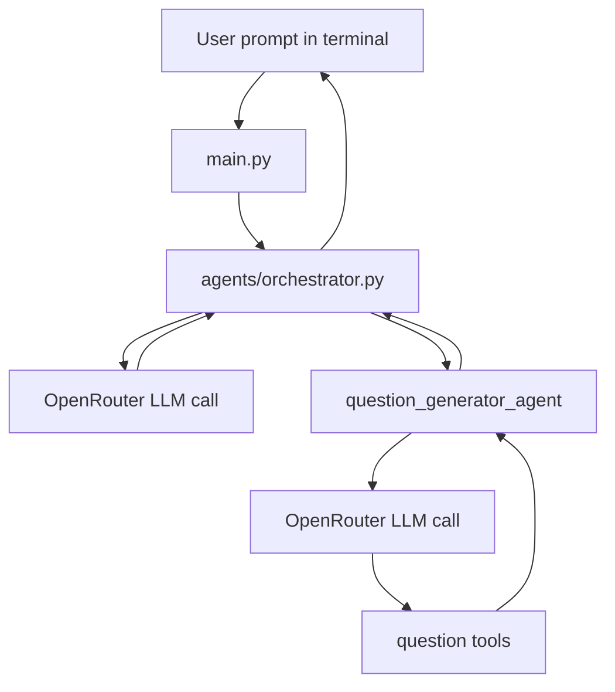

"""Quizey Multi-Agent System"""

# Quizey Multi-Agent System

Quizey is a small multi-agent Python project for building an assessment and training platform.
This repository currently focuses on one concrete use case: generating validated multiple-choice
questions with an orchestrator agent that delegates work to a specialized question generator agent.

The project is designed as a stepping stone for the larger Quizey platform, where future agents
can support content creation, evaluation, analytics, tutoring, and training workflows.

## What This Project Does

At the moment the system does the following:

1. Accepts a user prompt from the terminal.
2. Sends the request to an orchestrator agent.
3. Lets the orchestrator decide which specialized agent to call.
4. Uses the question generator agent to create and validate a multiple-choice question.
5. Returns the final answer to the user in the terminal.

The current agent chain is intentionally simple, but the structure is built so more agents can be
added later without rewriting the orchestrator manually.

## Why Responses Can Feel Slow

The response time is usually slower than a single direct LLM call because this project is a
multi-step agent system.

### Main reasons

- The orchestrator makes an LLM call first to decide what to do.
- If the orchestrator delegates, the specialized agent makes another LLM call.
- The question generator agent may call tools more than once.
- The agent loop allows retries, so the model can generate, validate, fix, and try again.
- OpenRouter latency depends on the selected model and provider load.
- Network round trips add time between each step.

### In this project specifically

For a single question request, the flow is usually:

1. User prompt -> orchestrator LLM call.
2. Orchestrator chooses `question_generator_agent`.
3. Question generator LLM call.
4. The agent may call `generate_question`.
5. The agent may call `validate_question`.
6. The agent may call `terminate`.
7. The result goes back to the orchestrator and then to the user.

So one user message can turn into several model interactions. That is normal for agent systems.

## Project Structure

- `main.py` - terminal entrypoint for the Quizey CLI.
- `llm.py` - OpenRouter wrapper used by all agents.
- `agents/` - agent modules.
- `agents/orchestrator.py` - top-level router that delegates to specialized agents.
- `agents/question_generator.py` - agent that generates and validates MCQ questions.
- `tools/question_tools.py` - tools used by the question generator agent.
- `registery/` - tool and agent registration helpers.
- `registery/decorators.py` - decorators for registering tools and agents.
- `registery/tool_registery.py` - registry for tools.
- `registery/agent_registry.py` - registry for agents.
- `.env` - local environment file for the OpenRouter API key.

## Architecture Overview



## How The Agent System Works

### 1. `main.py`

`main.py` is the CLI loop. It prints a prompt, waits for user input, and passes the prompt to the
orchestrator.

### 2. `agents/orchestrator.py`

The orchestrator is the top-level controller. It:

- loads available agents from the agent registry,
- sends the user request to the model,
- decides whether a tool/agent should be called,
- forwards the request to the selected agent,
- returns the final text response to the user.

### 3. `agents/question_generator.py`

This agent focuses on one task: producing a complete MCQ question and validating it.
It uses the tool registry to load question-generation tools tagged with `question_generation`.

### 4. `tools/question_tools.py`

This file defines the actual tools used by the question generator agent:

- `generate_question`
- `validate_question`
- `terminate`

These tools are registered automatically through decorators.

### 5. `registery/decorators.py`

This file contains the decorators that turn ordinary Python functions into registered tools or
agents.

### 6. `registery/tool_registery.py` and `registery/agent_registry.py`

These files store the registered tools and agents in memory and expose helper methods to retrieve
schemas and function references.

### 7. `llm.py`

This file is the OpenRouter adapter. It:

- loads variables from `.env`,
- reads `OPENROUTER_API_KEY`,
- calls OpenRouter through `litellm.completion`,
- normalizes tool-call responses into a format the agents can use.

## Setup

### Requirements

- Python 3.10+
- A virtual environment
- An OpenRouter API key

### Environment variables

Create a `.env` file in the project root:

```env
OPENROUTER_API_KEY=your_key_here
OPENROUTER_MODEL=cohere/north-mini-code:free
```

### Install dependencies

The project uses:

- `litellm`
- `python-dotenv`

If you need to install them manually:

```bash
pip install litellm python-dotenv
```

## Run The Project

From the project root:

```bash
python main.py
```

By default the project uses `cohere/north-mini-code:free` through OpenRouter because it is a
faster, tool-capable model for this kind of workflow. If you want to try another OpenRouter model,
set `OPENROUTER_MODEL` in `.env` and restart the app.

Example prompt:

```text
Generate a medium Python question about for loops
```

## Current Behavior

The current implementation generates a single MCQ question with:

- a topic,
- a difficulty level,
- a question stem,
- four answer choices,
- a correct answer,
- validation before the result is returned.

## Adding More Agents Later

The project is already set up so you can add more agents without hardcoding them into the
orchestrator.

To add a new agent:

1. Create a new module inside `agents/`.
2. Register the agent with `@register_agent(...)`.
3. Put its tool functions in a tagged tool module.
4. Importing the `agents` package will auto-load the module and register the agent.

## Important Notes

- The project currently relies on the active virtual environment.
- If the wrong interpreter is used, imports may appear broken in the editor even though the code
	runs correctly in the venv.
- The model choice and provider quality directly affect latency.
- Multi-agent systems are slower than single LLM calls by design, because they trade speed for
	control and validation.

## Troubleshooting

### `OPENROUTER_API_KEY is not set`

Make sure the `.env` file exists in the project root and that the key is spelled exactly as
`OPENROUTER_API_KEY`.

### Long response times

Possible causes:

- the orchestrator is making multiple calls,
- the question agent is calling tools repeatedly,
- OpenRouter or the selected model is slow at the moment,
- network latency,
- the model is stuck in a retry loop.

Possible improvements:

- use a faster or cheaper model,
- reduce agent retries,
- simplify the question-generation workflow,
- add streaming output,
- cache repeated tool results.

### Editor import warnings

If VS Code shows unresolved imports, reload the window or make sure the workspace Python
interpreter is set to the project venv.

## Quizey Roadmap

This repository is part of a broader plan for Quizey, an assessment and training platform.

Likely future modules include:

- question creation agents,
- validation agents,
- assessment builders,
- learner feedback agents,
- analytics and reporting agents,
- study/training recommendation agents.

## Security Note

Keep the OpenRouter key private. If a key is exposed publicly, rotate it immediately.

## Summary

This project is a working starting point for a larger Quizey platform. It demonstrates how to use
an orchestrator plus specialized agents, with registries for both tools and agents, to generate and
validate assessment content.
